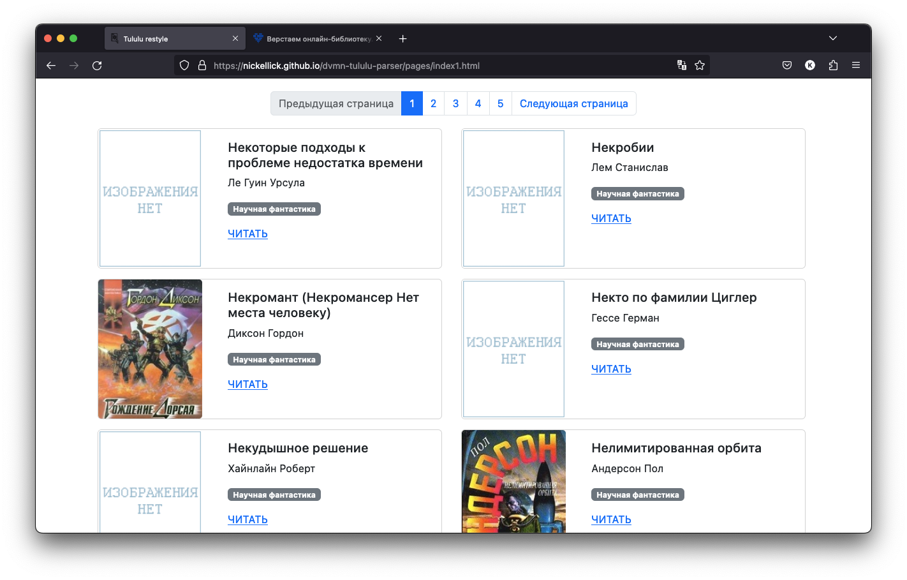

# Парсер книг с сайта [tululu.org](https://tululu.org)
Данный проект включает в себя
 - Набор функций для удобной работы с парсингом информации и скачиванием книг с сайта
 - Утилиту для полученя метаинформации о наборе книг
 - Набор функций и утилит для скачивания из категории "Научная фантакстика"
 - Сайт с набором книг

# Установка
Требуется установленный `Python 3.7` или новее. Скачать его можно [здесь](https://www.python.org/), или же в соответствующем репозитории для вашей ОС.
Для установки зависимостей используйте `pip` (или `pip3`, есть конфликт с `Python2`)
```
pip install -r requirements.txt
```

# Запуск
## Использование функций
Для использования функций для работы с [tululu.org](https://tululu.org/) достаточно импортировать пакет `tululu.py`
```py
import tululu
```
или
```py
from tululu import ...
```

Для функций, связанных с категорией, достаточно импортировать модуль
```py
import parse_tululu_category
```
или
```py
from tululu import ...
```

## Использование утилиты
Чтобы использовать утилиту для получения метаданных о книге необходимо ввести следующую команду
```
python tululu.py <start_id> <end_id>
```
Ключи `start_id` и `end_id` являются обязательными, вводятся без скобок.
 - `start_id` - id, начиная с которого будет выводиться информация о книгах.
 - `end_id` - id последней выводимой книги (включительно).

Пример:
```
python tululu.py 20 30
```
выведет метаинформацию с 20 по 30 книги включительно.

Для использования утилиты по скачиванию книги их категории необходимо ввести следующую команду
```
python parse_tululu_category --start_page <page_num> --end_page <page_num> --json_path <json_path> --dest_folder <folder_path> --skip_img --skip_txt
```
Ключ `start_page` является обязательным.
 - `start_page` - номер страницы, начиная с которой производится парсинг.
 - `end_page` - номер страницы, заканчивая которой (исключая её) производится парсинг. Если не указан - парсинг производится до последней страницы.
 - `json_path` - путь до файла, куда будут скачиваться данные о книгах. По умолчанию скачиваются в папку с результатами парсинга в файл `books.json`.
 - `dest_folder` - путь до папки с результататми парсинга. По умолчанию результаты парсинга складываются в папку `results`.
 - `skip_img` - пропустить скачивание картинок.
 - `skip_txt` - пропустить скачивание книг (текстовых файлов).

## Сайт
### Краткое описание
На основе данных, полученных с парсинга был написан небольшой сайт на `bootstrap 5.0`. Сайт готов к работе оффлайн. Перед его использованием обязательно необходимо отрендерить сайт!



### Рендеринг сайта
Для рендеринга сайта достаточно запустить модуль `render_website.py` (в таком случае также будет запущен простой веб-сервер), либо импортировать и вызывать из него функцию `render_pages`

```
python render_website.py
```

Пример сайта можно посмотреть на [github.io](https://nickellick.github.io/dvmn-tululu-parser) данного репозитория

# Цель проекта
Код написан в образовательных целях на онлайн-курсе для веб-разработчиков [dvmn.org](https://dvmn.org/).